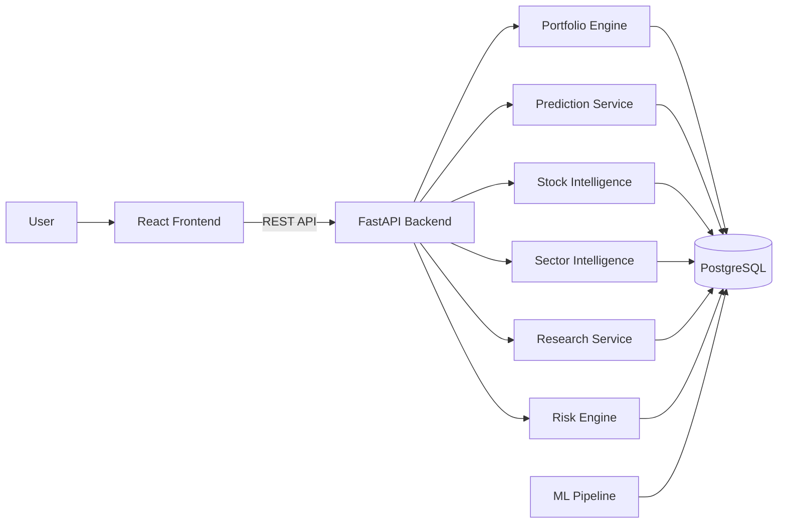
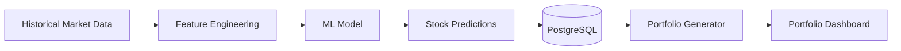
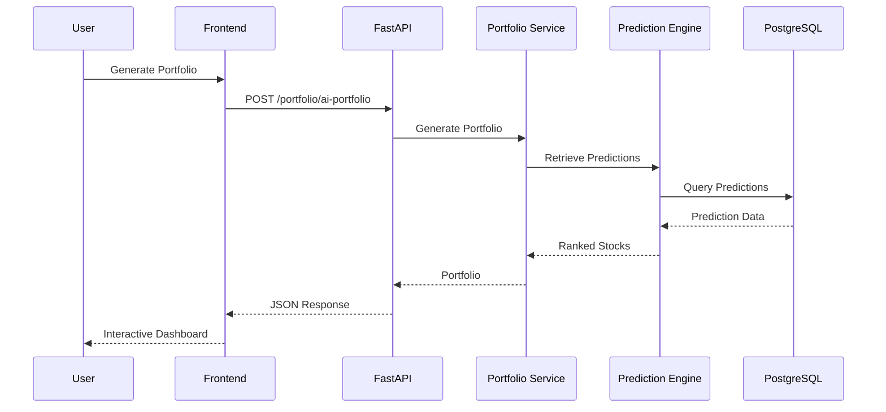

# 🚀 AI Hedge Fund

> **An end-to-end AI-powered institutional portfolio management platform that leverages machine learning, financial analytics, and interactive dashboards to generate optimized investment portfolios.**

---

# 🎥 Product Demo

> **Watch the complete application in action (3-minute walkthrough).**

<!-- Replace this with your uploaded GitHub video -->

https://github.com/user-attachments/assets/your-video-id

The demonstration includes:

- AI Portfolio Generation
- Portfolio Dashboard
- Stock Intelligence
- Sector Analytics
- Research Dashboard
- Risk Analysis
- End-to-End Workflow

---

## 🌐 Live Demo

| Service | Link |
|----------|------|
| **Frontend** | https://your-vercel-url.vercel.app |
| **Backend API** | https://your-railway-url.up.railway.app |

---

## ✨ Highlights

✔ End-to-End Machine Learning Platform

✔ Institutional Portfolio Generator

✔ FastAPI REST Backend

✔ React + TypeScript Dashboard

✔ PostgreSQL Database

✔ Portfolio Optimization Engine

✔ Stock Intelligence APIs

✔ Sector Analytics

✔ Cloud Deployment (Railway + Vercel)

✔ Production-Ready Architecture

---

## 🛠 Tech Stack

### Backend

- FastAPI
- SQLAlchemy
- PostgreSQL
- Pandas
- NumPy

### Machine Learning

- Scikit-Learn
- XGBoost
- Time Series Feature Engineering
- Portfolio Optimization

### Frontend

- React
- TypeScript
- Vite
- Tailwind CSS
- Recharts

### Deployment

- Railway
- Vercel

---

# 📖 Overview

AI Hedge Fund is an institutional-style portfolio management platform designed to demonstrate how modern machine learning systems can be transformed into production-ready financial applications.

Unlike traditional machine learning projects that end after model training, this platform delivers a complete end-to-end workflow—from data ingestion and prediction generation to portfolio construction, analytics, REST APIs, interactive dashboards, and cloud deployment.

The system integrates multiple components into a unified architecture, including:

- Machine Learning Prediction Engine
- Portfolio Generation Engine
- Stock Intelligence
- Sector Intelligence
- Research Dashboard
- Risk Analytics
- PostgreSQL Data Layer
- FastAPI REST APIs
- React Dashboard
- Cloud Deployment

The project emphasizes software engineering alongside machine learning, showcasing modular architecture, API-driven development, persistent storage, and full-stack integration.

---

# 🎯 Key Features

## 📊 AI Portfolio Generator

Generate investment portfolios based on:

- Investment amount
- Risk profile
- Preferred sectors
- Maximum holdings

Features include:

- Dynamic allocation
- Portfolio persistence
- Allocation visualization
- Portfolio summary

---

## 📈 Stock Intelligence

Analyze individual securities using machine learning outputs.

Features:

- Prediction probability
- Expected return
- Risk score
- Investment recommendation

---

## 🏢 Sector Analytics

Sector-level intelligence including:

- Sector performance
- Average prediction confidence
- Average expected return
- Average risk
- Top performing stocks

---

## 🔬 Research Dashboard

Centralized market intelligence including:

- Portfolio insights
- Market analytics
- Research summaries
- AI-generated recommendations

---

## ⚙ REST APIs

Production-ready FastAPI backend exposing endpoints for:

- Portfolio Generation
- Predictions
- Stock Intelligence
- Sector Intelligence
- Risk Analytics

---

## ☁ Cloud Deployment

Fully deployed application using:

- Railway (Backend)
- PostgreSQL Database
- Vercel (Frontend)

# 🏗️ System Architecture



---

## 🏛 Architecture Overview

The platform follows a modular service-oriented architecture that separates responsibilities across the frontend, backend, machine learning pipeline, and persistence layer.

### Frontend

The frontend is built using **React + TypeScript** and provides an interactive dashboard for investors to:

- Generate AI portfolios
- Explore stock intelligence
- Analyze sectors
- View portfolio analytics
- Research investment opportunities

The frontend communicates exclusively through REST APIs exposed by the backend.

---

### Backend

The backend is developed using **FastAPI** and is organized into independent services responsible for different business domains.

Core backend services include:

- Portfolio Generation
- Prediction Engine
- Stock Intelligence
- Sector Intelligence
- Research Service
- Risk Analytics

This modular design allows each service to evolve independently while exposing a unified REST interface.

---

### Machine Learning Layer

The prediction engine uses historical financial features to generate stock-level predictions.

The ML pipeline consists of:

- Data preprocessing
- Feature engineering
- Model inference
- Prediction storage
- Portfolio generation

Predictions are persisted into PostgreSQL and consumed by downstream portfolio services.

---

### Database Layer

PostgreSQL serves as the centralized data store for:

- ML Predictions
- Feature Store
- Portfolio Data
- Portfolio Holdings
- Risk Metrics

Using a relational database enables efficient querying, persistence, and API-driven analytics.

---

### Deployment

The platform is deployed as a cloud-native web application.

| Component | Platform |
|-----------|----------|
| Frontend | Vercel |
| Backend | Railway |
| Database | Railway PostgreSQL |

This architecture demonstrates an end-to-end production deployment workflow.

# 📂 Project Structure

```text
AI_Hedge_Fund
│
├── apps/
│   └── api/
│       ├── routes/
│       └── main.py
│
├── services/
│   ├── portfolio/
│   ├── prediction/
│   ├── research/
│   ├── sector/
│   └── risk/
│
├── ml/
│   ├── feature_engineering/
│   ├── models/
│   ├── training/
│   └── backtesting/
│
├── shared/
│   ├── configs/
│   ├── schemas/
│   ├── constants/
│   └── utilities/
│
├── frontend/
│   ├── src/
│   ├── components/
│   ├── pages/
│   └── services/
│
├── data/
│
├── pipelines/
│
├── Procfile
├── requirements.txt
└── README.md
```

---

## 📁 Directory Overview

| Directory | Description |
|------------|-------------|
| `apps/` | FastAPI application and API routes |
| `services/` | Business logic for portfolio generation, research, risk, and analytics |
| `ml/` | Machine learning models, training, inference, and backtesting |
| `shared/` | Shared schemas, database configuration, constants, and utilities |
| `frontend/` | React + TypeScript user interface |
| `data/` | Processed datasets and intermediate files |
| `pipelines/` | Data preprocessing and feature engineering pipelines |

# 🤖 Machine Learning Pipeline

The AI Hedge Fund platform follows a structured machine learning workflow that transforms historical market data into actionable portfolio recommendations.



---

## 📊 Workflow

### 1. Data Collection

Historical stock market data is collected and prepared for analysis.

The dataset includes:

- Historical prices
- Returns
- Volatility
- Market indicators
- Technical signals

---

### 2. Feature Engineering

Raw market data is transformed into machine learning features suitable for prediction.

Typical engineered features include:

- Daily Returns
- Rolling Returns
- Moving Averages
- Volatility
- Momentum Indicators
- Technical Indicators

The processed feature set is stored inside the Feature Store for reuse.

---

### 3. Model Inference

The trained machine learning model predicts future stock behavior.

Each prediction generates:

- Predicted Class
- Prediction Probability
- Expected Return
- Confidence Score

These predictions are persisted into PostgreSQL.

---

### 4. Portfolio Construction

The portfolio engine consumes model predictions and constructs portfolios based on user preferences.

Inputs include:

- Investment Amount
- Risk Profile
- Preferred Sectors
- Maximum Holdings

The engine allocates capital across selected securities while maintaining diversification.

---

### 5. Portfolio Analytics

Once generated, portfolios are enriched with additional analytics such as:

- Allocation Percentage
- Sector Distribution
- Expected Return
- Portfolio Risk
- Top Holdings

These metrics are served through REST APIs to the frontend dashboard.

---

# 🗄 Database Schema

The application uses PostgreSQL as the primary persistence layer.

## Core Tables

| Table | Purpose |
|--------|----------|
| `predictions` | Machine learning predictions |
| `feature_store` | Engineered features |
| `final_portfolio` | Generated portfolios |
| `backtest_predictions` | Historical prediction results |

---

## Data Flow

```text
Historical Data
        │
        ▼
Feature Engineering
        │
        ▼
Feature Store
        │
        ▼
ML Predictions
        │
        ▼
Predictions Table
        │
        ▼
Portfolio Generator
        │
        ▼
Final Portfolio
```

The database acts as the central source of truth for both the backend services and the analytics dashboard.

---

# 🔌 REST API

The backend exposes a modular REST API built using FastAPI.

## Portfolio

| Method | Endpoint | Description |
|----------|-----------|------------|
| POST | `/portfolio/ai-portfolio` | Generate AI portfolio |
| GET | `/portfolio/latest` | Retrieve latest portfolio |

---

## Predictions

| Method | Endpoint | Description |
|----------|-----------|------------|
| GET | `/predictions` | Retrieve ML predictions |

---

## Stock Intelligence

| Method | Endpoint | Description |
|----------|-----------|------------|
| GET | `/stock-intelligence/{ticker}` | Stock analytics |

---

## Sector Intelligence

| Method | Endpoint | Description |
|----------|-----------|------------|
| GET | `/sector-intelligence` | Sector analytics |

---

## Research

| Method | Endpoint | Description |
|----------|-----------|------------|
| POST | `/research` | AI research insights |

---

## Risk

| Method | Endpoint | Description |
|----------|-----------|------------|
| GET | `/risk` | Portfolio risk metrics |

---

# ⚡ Backend Workflow


# 🚀 Getting Started

## Clone the Repository

```bash
git clone https://github.com/<username>/AI_Hedge_Fund.git
cd AI_Hedge_Fund
```

## Backend

```bash
python -m venv .venv
source .venv/bin/activate

pip install -r requirements.txt

uvicorn apps.api.main:app --reload
```

## Frontend

```bash
cd frontend

npm install

npm run dev
```

---

## Environment Variables

Create a `.env` file with the following variables:

```env
DATABASE_URL=
GROQ_API_KEY=
PINECONE_API_KEY=
```
# 📸 Application Preview

## Portfolio Generator


---

## Stock Intelligence


---

## Sector Analytics


---

## Research Dashboard


# 👨‍💻 Author

**Vaibhav Kavdia**

B.Tech, Indian Institute of Technology Roorkee

- GitHub: https://github.com/yourusername
- LinkedIn: https://linkedin.com/in/yourprofile

---

## ⭐ If you found this project interesting, consider giving it a star.